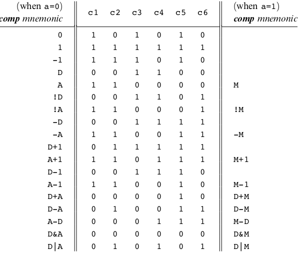
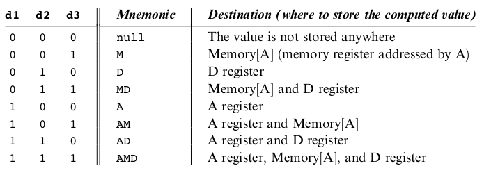
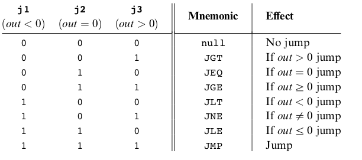

# Hack Machine Language

- [Hack Machine Language](#hack-machine-language)
  - [The Hack Computer](#the-hack-computer)
    - [Architecture](#architecture)
    - [Control](#control)
    - [Registers](#registers)
  - [The Hack Machine Language](#the-hack-machine-language)
    - [Syntax](#syntax)
      - [A-instructions](#a-instructions)
      - [C-Instructions](#c-instructions)
    - [Specifications](#specifications)
      - [The A-instruction](#the-a-instruction)
      - [The C-instruction](#the-c-instruction)
      - [Symbols](#symbols)


Hack computer is a 16-bit computer, (16-bit) is basically the atomic unit of information in this computer, which means, to move data around, you need to move 16 bits of memory chunks at a time.

## The Hack Computer


### Architecture

The hack computer consists of:

- **CPU**: performs 16-bit instructions
- **RAM**: a sequence of 16-bit registers RAM[0, RAM[1], ..., RAM[32,767]
- **ROM**: a sequence of 16-bit registers ROM[0], ROM[1], ..., ROM[32,767]
- **Instruction bus**, **data bus**, **address buses**.

### Control

The CPU is controlled by a program stored in the ROM. The program is a sequence of 16-bit instructions, each instruction is stored in a separate ROM register. The CPU executes the program by repeatedly performing the following steps:

1. ROM is loaded with a Hack program.
2. The reset buttom is pushed.
3. The program starts running.

### Registers

The CPU has three internal registers: A, D, and M.

- D holds a 16-bit value.
- A holds a 16-bit value.
- M represents the 16-bit RAM register addressed by A.

## The Hack Machine Language

The hack machine language consists of:

- 16-bit A-instructions
- 16-bit C-instructions

Any program written in Hack consists of a sequence of instructions written in the hack machine language.

### Syntax

#### A-instructions

Syntax:

```asm
@value
```

where `value` is a 15-bit value, non-negative constant, or a symbol referring to a constant.

Example:

```asm
@21
@i
```

In this example, `@21` is a constant, and `@i` is a symbol referring to a constant. The value stored in register `A` is the value of the constant. As a side effect, `RAM[A]` becomes the currently selected RAM register.

Example:

```asm
@100        // A = 100
M = -1      // Set RAM[100] to -1
```

#### C-Instructions

Syntax:

```asm
Dest = Comp ; Jump   // both Dest and Jump are optional
```

where:

- `Dest` could be any of the following operations: `null`, `M`, `D`, `MD`, `A`, `AM`, `AD`, `AMD`.

> `null` means: do not store the result anywhere.
> `M` means: store the result in the RAM register addressed by `A`.
> We can restore the results of the computations in multiple registers simultaneously such as `MD`, or `AMD`.

- `Comp` could be any of the following operations: `0`, `1`, `-1`, `D`, `A`, `!D`, `!A`, `-D`, `-A`, `D+1`, `A+1`, `D-1`, `A-1`, `D+A`, `D-A`, `A-D`, `D&A`, `D|A`, `M`, `!M`, `-M`, `M+1`, `M-1`, `D+M`, `D-M`, `M-D`, `D&M`, `D|M`.

> `0` means: `false`
> `1` means: `true`
> `D` means: the value stored in the `D` register
> Logical operations such as: `!`, `&`, `|` are applied to the value stored in registers.
> Arithmetic operations such as: `+`, `-` are applied to the values stored in two registers.

- `Jump` could be any of the following operations: `null`, `JGT`, `JEQ`, `JGE`, `JLT`, `JNE`, `JLE`, `JMP`.

> The jump operations are used to control the flow of the program. The value of the computation is compared with zero, if the result is `true`, then the jump is taken to `ROM[A]`, otherwise, the next instruction in the program is executed.

Examples:

```asm
D = -1
@300
M = D - 1   // RAM[300] = -2
```

```asm
// if (D-1 == 0) jump to execute the instruction stored in ROM[A], such that A = 56

@56             // A = 56
D-1;JEQ      // if (D-1 == 0) jump to execute the instruction stored in ROM[A]
```

### Specifications

#### The A-instruction

The A-instruction is used to set the A register to a 15-bit value:

Symbolic:

```asm
@value  // A = value
```

Binary:
  
```asm
0 value[14] value[13] ... value[0]
```

This instruction causes the A register to store the specified value in the instruction. For example, the instruction `@5` causes the A register to store the value `5`. Therefore, the binary value `0000 0000 0000 0101` is loaded into the A register.

The A-instruction is used for 3 different purposes:

- To set the A register to a constant value.
- To set the A register to the value stored in a RAM register (it sets the stage for a subsequent C-instruction designed to manipulate a certain data memory location, by first setting A to the address of that location)
- It sets the jump destination (it sets the stage for a subsequent C-instruction that specifies a jump, by first loading the address of the
jump destination to the A register)

#### The C-instruction

The C-instruction is the programming workhorse of the Hack platform—the instruction that gets almost everything done. The instruction code is a specification that answers three questions:

1. what to compute,
2. where to store the computed value, and
3. what to do next? Along with the A-instruction

C-instruction:

``` asm
dest = comp;jump
// Either the dest or jump fields may be empty.
// If dest is empty, the ‘‘=’’ is omitted;
// If jump is empty, the ‘‘;’’ is omitted.
```

Binary:

``` asm
111 a c1 c2 c3 c4 c5 c6 d1 d2 d3 j1 j2 j3
```

- `1` is the C-instruction marker bit.
- `11` are not used.
- `a c1 c2 c3 c4 c5 c6` are the comp field.
- `d1 d2 d3` are the dest field.
- `j1 j2 j3` are the jump field.

The following tables show the op-code for each possible comp, dest, and jump fields.





#### Symbols

- Predefined symbols: A special subset of RAM addresses can be referred to by any assembly program using the following predefined symbols:
  - Virtual Registers: `R0`, `R1`, ..., `R15` are mapped to the virtual registers `0`, `1`, ..., `15`.
  - Predefined Pointers: `SP`, `LCL`, `ARG`, `THIS`, `THAT` are mapped to the addresses `0` to `4`, respectively.
- I/O Pointers: `SCREEN` and `KBD` are mapped to the addresses `16384` (0x4000) and `24576` (0x6000), respectively.
- Label symbols: These user-defined symbols, which serve to label destinations of `goto` commands, are declared by the pseudo-command ‘‘ (Xxx) ’’.
- Veriable symbols: These user-defined symbols, which serve to name memory locations, are declared by the pseudo-command ‘‘ @Xxx ’’, and is assigned a unique memory address by the assembler, starting at RAM address 16 (0x0010).
