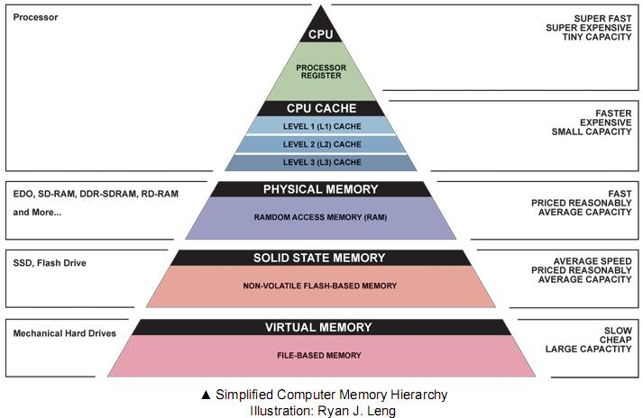

# Machine Language

## Introduction

Machine language, also known as machine code, is the lowest-level programming language understood by computers. It is a set of instructions that a computer's central processing unit (CPU) can directly execute. Machine language is binary code consisting of sequences of 0s and 1s, which represent specific operations that the CPU can perform.

Every computer's CPU is designed to understand a specific machine language, unique to its architecture. Each instruction in machine language corresponds to a specific operation, such as arithmetic calculations, data movement, branching, and logic operations.

Programs written in high-level programming languages (like Python, C++, Java, etc.) are not directly executed by the CPU. Instead, they need to be translated into machine language before the CPU can understand and execute them. This translation is typically done by a compiler or an interpreter.

The process of converting high-level programming code into machine language involves several steps:

1. **Compilation (for compiled languages)**: In this process, the entire source code of a program is converted into machine code by a compiler. The resulting machine code is stored in an executable file, which the CPU can directly run.

2. **Interpretation (for interpreted languages)**: In interpreted languages, the source code is translated line-by-line or statement-by-statement into machine code at runtime by an interpreter. The CPU then executes these translated instructions.

Machine language provides the most direct and efficient way for a computer to perform tasks because it matches the computer's internal architecture. However, it is not easily human-readable or writable like high-level programming languages, making it challenging for programmers to directly write programs in machine language. Instead, high-level programming languages provide an abstraction that makes programming more accessible and less error-prone for humans.

## Assembly vs Machine Language

Machine language and assembly language are both low-level programming languages, but they differ in their level of abstraction and human-readability.

1. **Abstraction Level:**
   - Machine Language: It is the lowest-level programming language that directly represents the instructions executed by a computer's CPU. It consists of binary code, usually represented as sequences of 0s and 1s, which correspond to specific CPU instructions. Machine language is specific to the computer's hardware architecture.
   - Assembly Language: It is a low-level programming language that provides a more human-readable representation of machine language instructions. Assembly language uses mnemonics (abbreviated symbols) to represent CPU instructions, making it easier for programmers to understand and write code compared to raw binary machine language.

2. **Representation:**
   - Machine Language: Uses binary code, which is the actual instruction set understood by the CPU. Each binary instruction directly maps to a specific operation the CPU can perform.
   - Assembly Language: Uses *mnemonics* that represent individual machine language instructions. These mnemonics are then translated into machine language using an [assembler]().

3. **Readability:**
   - Machine Language: Not easily readable by humans due to its binary representation. It is composed of 0s and 1s, which are difficult for programmers to interpret and write.
   - Assembly Language: More human-readable than machine language because it uses mnemonics that are closer to natural language and are easier for programmers to understand and write.

4. **Portability:**
   - Machine Language: Not portable across different computer architectures. Programs written in machine language are specific to the hardware on which they were developed.
   - Assembly Language: Somewhat portable, as it can be adapted to different computer architectures by changing the assembler or using different assembly directives.

5. **Translation:**
   - Machine Language: Does not require translation, as it is the native language of the computer's CPU.
   - Assembly Language: Requires translation into machine language using an assembler. The output of the assembler is a binary file that the CPU can execute.

In summary, assembly language serves as a more human-readable and writable representation of machine language, using mnemonics to represent CPU instructions. It provides an intermediary step between high-level programming languages and machine code, making it easier for programmers to work with low-level operations while retaining some level of portability across different architectures. Machine language, on the other hand, is the most direct representation of CPU instructions and is specific to the computer's hardware.

## Machine Language Features

Machine language supports operations that can be executed directly by the machine's CPU. These operations are typically related to arithmetic, data movement, branching, and logic.

### Addressing and Memory Hirarchy

Machine language instructions can specify the memory address of the data they operate on. This allows the CPU to directly access data stored in memory without having to perform additional calculations to determine the data's location.

Accessing a memory location is expensive, as we need to supply long addresses and wait for the memory to respond. To reduce the number of memory accesses, the CPU uses a small amount of fast memory called a cache. The cache stores recently accessed data and instructions, allowing the CPU to access them quickly without having to go to main memory.



The memory hierarchy consists of several levels of memory, each with different access speeds and capacities. The CPU first checks the cache for the data it needs. If the data is not found in the cache, it checks the main memory. If the data is not found in the main memory, it checks the secondary storage (hard disk, SSD, etc.).

### Registers

Memory access is a relatively slow operation, requiring long instruction formats (an address may require 32 bits). For this reason, most processors are equipped with several registers, each capable of holding a single value. Located in the processor’s immediate proximity, the registers serve as a high-speed local memory, allowing the processor to manipulate data and instructions quickly. This setting enables the programmer to minimize the use of memory access commands, thus
 peeding up the program’s execution.

### Addressing Modes

#### Registers Mode

```nasm
Add R1, R2          // R2 = R1 + R2
```

The instruction above adds the contents of registers R1 and R2 and stores the result in R2. The instruction’s format is as follows:

```nasm
DestReg = DestReg + SrcReg
```

#### Immediate Mode

```nasm
Add 5, R1           // R1 = R1 + 5
```

The instruction above adds the contents of register R1 and the constant 5 and stores the result in R1. The instruction’s format is as follows:

```nasm
DestReg = DestReg + Const
```

#### Direct Mode

```nasm
Add R1, M[200]      // M[200] = R1 + M[200]
```

The instruction above adds the contents of register R1 and the contents of memory location 200 and stores the result in R1. The instruction’s format is as follows:

```nasm
M[Addr] = DestReg + M[Addr]
```

#### Indirect Mode

```nasm
Add R1, @A      // M[A] = R1 + M[A]
```

The instruction above adds the contents of register R1 and the contents of memory location A and stores the result in R1. The instruction’s format is as follows:

```nasm
M[Addr] = DestReg + M[Addr]
```

### IO devices

The CPU communicates with I/O devices through a special set of instructions. These instructions are used to transfer data between the CPU and I/O devices, as well as to control the operation of I/O devices.

The CPU needs some sort of a *protocol* to talk to each device, these protocols are called *device drivers*. The device driver is a piece of software that translates the CPU’s commands into a language that the device can understand.

#### Memory mapping

memory location xxx is mapped to the device’s control register. The CPU can read and write to this memory location to control the device.

### Flow Control

Normally, the CPU executes machine instructions sequentially. Sometimes, we need to jump (conditionally / unconditionally) to create a loop.

```nasm
Loop:   Add R1, R2
        Sub R3, R4
        Jmp Loop
```

The instruction above creates an infinite loop. The instruction’s format is as follows:

```nasm
Jmp Label
```

A conditional jump is a jump that is performed only if a certain condition is met. For example, the following instruction jumps to the label Loop only if the contents of register R1 are equal to the contents of register R2:

```nasm
JGT R1, R2, Loop    // Jump to Loop if R1 > R2
```
